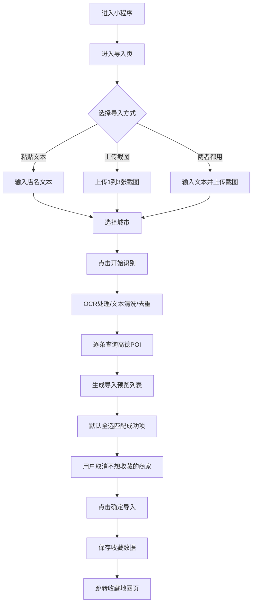

# 美食地图助手 低保真页面草图与用户流程图

## 1. 文档用途

这份文档用于给你快速审页面和流程，不涉及视觉风格，只看结构、信息层级和操作顺序。

阅读重点：

- 页面里该放什么
- 用户先做什么，后做什么
- 哪些地方可能还需要改

## 2. 总体导航结构

```text
[导入页]
   -> [导入预览页]
   -> [收藏地图页]
   <-> [收藏列表页]
```

## 3. 页面 ASCII 草图

### 3.1 导入页

目标：

- 让用户快速开始一次导入
- 支持文本粘贴和最多 3 张截图 OCR
- 在开始识别前先选城市

```text
+--------------------------------------------------+
| 美食地图助手                               [收藏地图] |
+--------------------------------------------------+
| 标题：一键导入你种草的店                           |
| 说明：粘贴店名文本，或上传截图让我帮你识别           |
+--------------------------------------------------+
| 城市选择                                          |
| [ 上海 ▼ ]                                        |
+--------------------------------------------------+
| 粘贴店名文本                                      |
| +----------------------------------------------+ |
| | 可粘贴视频简介、评论区或笔记里的店名            | |
| | 例如：                                         | |
| | 老吉士酒家                                     | |
| | 阿娘面馆                                       | |
| | 兰心餐厅                                       | |
| +----------------------------------------------+ |
+--------------------------------------------------+
| 上传截图识别（最多 3 张）                          |
| +-------------+ +-------------+ +-------------+  |
| |   上传图片   | |   上传图片   | |   上传图片   |  |
| |    slot 1    | |    slot 2    | |    slot 3    |  |
| +-------------+ +-------------+ +-------------+  |
+--------------------------------------------------+
| [ 开始识别 ]                                      |
+--------------------------------------------------+
| 识别说明                                          |
| - 支持 1 家到多家店                               |
| - 自动去重、自动查询评分/人均/地址/位置             |
| - 上传图片后会显示识别中状态，超时会提示重试         |
+--------------------------------------------------+
```

关键交互：

- 文本和图片可以同时提交
- `开始识别` 按钮只有在“已选城市 + 有输入内容”时才可点
- 点击后进入处理中页或直接进入导入预览页 loading 状态

你重点可以看：

- 城市选择是否要放到更上面
- 文本输入区和图片上传区是否需要更强的二选一提示

### 3.2 导入预览页

目标：

- 用户在正式收藏前快速筛选商家
- 默认全选，用户只需要取消不要的店

```text
+--------------------------------------------------+
| < 返回                  识别结果预览               |
+--------------------------------------------------+
| 共识别 10 家 | 匹配成功 8 家 | 当前已选 8 家         |
+--------------------------------------------------+
| [全选]  [全不选]  [仅看匹配成功]                    |
+--------------------------------------------------+
| [✓] 老吉士酒家(天平路店)                           |
|     评分 4.6   人均 ¥168                           |
|     地址：天平路41号                               |
|     状态：已匹配                                  |
+--------------------------------------------------+
| [✓] 阿娘面馆                                      |
|     评分 4.4   人均 ¥52                            |
|     地址：思南路36号                               |
|     状态：已匹配                                  |
+--------------------------------------------------+
| [ ] 某某小馆                                      |
|     暂无评分   暂无人均                            |
|     地址：暂无地址                                |
|     状态：未匹配成功                               |
+--------------------------------------------------+
| 已选择 8 家                               [确定导入] |
+--------------------------------------------------+
```

关键交互：

- 默认所有匹配成功项为勾选状态
- 未匹配成功项默认不勾选
- 用户只做“取消不要的店”这个动作
- 点击 `确定导入` 后进入收藏库并跳转地图页

你重点可以看：

- 卡片信息是否够用
- 是否需要增加“切换候选门店”入口
- `全不选` 是否真有必要放在主操作区

### 3.3 收藏地图页

目标：

- 让用户直接看出店的分布情况
- 成为产品最常用页面

```text
+--------------------------------------------------+
| 收藏地图                                [列表查看] |
+--------------------------------------------------+
| 已收藏 24 家                                      |
+--------------------------------------------------+
|                                                  |
|                  地 图 区 域                       |
|                                                  |
|        ● 老吉士                                   |
|      ● 阿娘面馆                                   |
|                              ● 兰心餐厅           |
|                                                  |
|                    ● 另一家商户                    |
|                                                  |
|     （打开页面后自动缩放，显示全部收藏门店）        |
|                                                  |
+--------------------------------------------------+
| 当前选中门店                                      |
| 老吉士酒家(天平路店)                              |
| 评分 4.6    人均 ¥168                             |
| 特色菜：红烧肉 / 葱烤大排 / 蟹粉豆腐               |
| 地址：天平路41号                                  |
| [取消收藏]                [查看列表位置]           |
+--------------------------------------------------+
| [继续导入新门店]                                  |
+--------------------------------------------------+
```

关键交互：

- 打开页面默认框住所有门店
- 点 marker，底部切换成对应商家的信息卡片
- 卡片内可直接取消当前门店收藏
- 地图页不做距离数字计算，只看分布

你重点可以看：

- 地图页底部卡片信息是否太多或太少
- 是否要把 `继续导入新门店` 放成浮动按钮而不是底部按钮

### 3.4 收藏列表页

目标：

- 方便按列表浏览收藏
- 方便删除和定位单个商家

```text
+--------------------------------------------------+
| < 地图页                    收藏列表（24）          |
+--------------------------------------------------+
| [搜索框 - V1 可先不做]                            |
+--------------------------------------------------+
| 老吉士酒家(天平路店)                              |
| 评分 4.6   人均 ¥168                              |
| 特色菜：红烧肉 / 葱烤大排 / 蟹粉豆腐               |
| 地址：天平路41号                                  |
| [地图定位]                         [删除]          |
+--------------------------------------------------+
| 阿娘面馆                                          |
| 评分 4.4   人均 ¥52                               |
| 特色菜：黄鱼面 / 蟹粉面 / 雪菜黄鱼                 |
| 地址：思南路36号                                  |
| [地图定位]                         [删除]          |
+--------------------------------------------------+
| 兰心餐厅                                          |
| 评分 4.5   人均 ¥120                              |
| 特色菜：葱油鸡 / 咸肉菜饭 / 蚝油牛肉               |
| 地址：进贤路130号                                 |
| [地图定位]                         [删除]          |
+--------------------------------------------------+
```

关键交互：

- 删收藏
- 回到地图并定位某一家
- 作为地图页的补充，不抢地图页核心地位

你重点可以看：

- 这个页面是否需要在 V1 出现
- 删除操作是否要加二次确认

## 4. 页面关系草图

```text
┌──────────┐
│  导入页   │
└────┬─────┘
     │ 开始识别
     v
┌────────────┐
│ 导入预览页  │
└────┬───────┘
     │ 确定导入
     v
┌────────────┐
│ 收藏地图页  │<────────────┐
└────┬───────┘             │
     │ 查看列表             │ 返回地图
     v                     │
┌────────────┐             │
│ 收藏列表页  │─────────────┘
└────────────┘
```

## 5. 用户操作流程图

### 5.1 主流程总览



### 5.2 文本导入详细流程

```text
[进入导入页]
   -> [粘贴店名文本]
   -> [选择城市]
   -> [点击开始识别]
   -> [系统拆分文本]
   -> [系统去重和清洗]
   -> [系统逐条查高德]
   -> [展示导入预览]
   -> [用户取消不要的店]
   -> [确定导入]
   -> [跳转地图页]
```

### 5.3 OCR 导入详细流程

```text
[进入导入页]
   -> [上传1到3张截图]
   -> [选择城市]
   -> [点击开始识别]
   -> [系统OCR识别文字]
   -> [显示识别中状态]
   -> [系统合并多张图结果]
   -> [系统去重和清洗]
   -> [系统逐条查高德]
   -> [展示导入预览]
   -> [用户取消不要的店]
   -> [确定导入]
   -> [跳转地图页]

超时分支：

   -> [超过15秒未完成]
   -> [提示识别超时]
   -> [用户重试]
```

### 5.4 收藏查看流程

```text
[进入收藏地图页]
   -> [查看门店在地图上的分布]
   -> [点击某个marker]
   -> [查看底部商家卡片]
   -> [进入收藏列表页]
   -> [删除收藏 or 回地图定位]
```

## 6. 关键状态流转图

### 6.1 导入任务状态

```text
待输入
  -> 提交中
  -> OCR处理中（如有图片）
  -> 文本清洗中
  -> 高德查询中
  -> 预览可查看
  -> 已确认导入
  -> 收藏完成
```

失败分支：

```text
OCR失败
查询失败
导入失败
```

### 6.2 单个商家结果状态

```text
待查询
  -> 匹配成功
  -> 匹配失败
  -> 匹配成功但字段缺失
```

## 7. 我建议你重点审的几个点

### 点 1：导入页是否太重

现在导入页同时放了：

- 城市选择
- 文本输入
- 图片上传
- 识别说明

你需要看的是，是否想更轻一点，例如把“识别说明”收起来。

### 点 2：导入预览卡片的信息密度

当前一张卡片里有：

- 店名
- 评分
- 人均
- 地址
- 匹配状态

你需要看的是，地址是否可以缩短，或者只在点开详情时展示。

### 点 3：地图页是否要加筛选

V1 目前没有筛选器，例如：

- 只看高评分
- 只看某商圈

如果你觉得地图点一多会乱，可以下一轮再补筛选。

### 点 4：列表页是否要保留

V1 如果追求极简，也可以先只做：

- 导入页
- 导入预览页
- 收藏地图页

把“列表页”延后。

## 8. 你可以怎么给我反馈

你可以直接按下面这种方式提修改：

- 导入页：把城市选择放到最顶部
- 导入预览页：地址不要展示，只显示商圈
- 地图页：底部卡片改成半屏抽屉
- 列表页：V1 先砍掉
- 流程：OCR 后先让我手动删掉脏文本，再去查高德

你把想改的地方直接点出来，我下一轮就按这个文档继续修。
